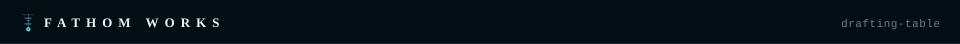

<p align="center"></p>

# `$ drafting-table`

**A private mood board where you drop a link, a screenshot, or a note, and an AI assistant files it and keeps your project's ideas up to date.** Each project gets its own board of reference cards.

*A [Fathom Works](https://github.com/Jemplayer82) project.*

**In plain terms:** it is for anyone collecting design inspiration who is tired of copying notes into a chat by hand. You drop things in. The assistant reads them and rewrites the "Ideas & direction" and "Open questions" sections using the whole board, not just the newest item. It replaces a hand-kept claude.ai Artifact (a shareable page made in Claude) that needed a chat round-trip for every update.

## `[ quick start ]`

Set it up and run it on your own computer. Run these in order:

```bash
uv sync
cp .env.example .env
uv run python -m hashpw                 # generates ADMIN_PASSWORD_HASH — paste it into .env
claude setup-token                       # subscription auth, NOT an API key — see .env.example
uv run flask --app app run --debug       # web
uv run python -m worker                  # job worker, separate process
```

Visit `http://localhost:5000` (or whatever port Flask picks in debug mode).

## `[ usage ]`

- Open the landing page. Each project is one tile; click a tile to see its full board.
- Use the single box to drop a link, an image, or a note. There is no mode picker.
- The assistant fetches the link, looks at the image, then rewrites the project's summary from the whole board.
- Every rewrite is saved as a new version, never overwritten. A diff view shows what changed and which item caused it.
- A decisions log survives each rewrite. The assistant can propose decisions but cannot edit or delete them.
- Links are fetched by a plain, guarded web client, not a headless browser. See [docs/security.md](docs/security.md) for why.

## `[ configuration ]`

All settings are environment variables. [`.env.example`](.env.example) lists every one with generation commands. Nothing has a working default: the app refuses to start without `ADMIN_USER` and `ADMIN_PASSWORD_HASH`.

| Variable | What it does |
|---|---|
| `ADMIN_USER` | Login name. Required. |
| `ADMIN_PASSWORD_HASH` | Hashed login password. Make it with `uv run python -m hashpw`. Required. |
| `SESSION_SECRET` | Signs login sessions. |
| `CLAUDE_CODE_OAUTH_TOKEN` | Lets the assistant run on your Claude subscription. Get it from `claude setup-token`. Not an API key. |

For a server install, mount the secrets as files instead of plain environment variables. See [docs/deploy.md](docs/deploy.md).

## `[ docs ]`

- [docs/deploy.md](docs/deploy.md) — run the pre-built image with `docker compose up -d`, and keep secrets safe.
- [docs/security.md](docs/security.md) — why there is no headless browser.
- [CONTRIBUTING.md](CONTRIBUTING.md) — how to contribute.

## `[ license ]`

Apache License 2.0 — see [LICENSE](LICENSE).


